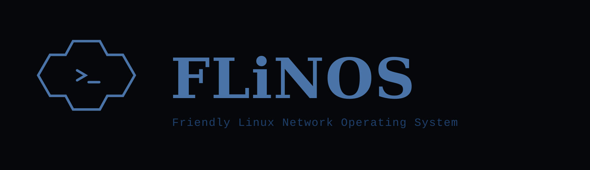

# FLiNOS

  

> **Status: in development.** FLiNOS is not yet ready for production use.

FLiNOS (**Friendly Linux Network Operating System**) is a Debian-based network
appliance designed to feel like a data-center switch. It provides Layer 2 and
Layer 3 networking in a purpose-built operating environment, while remaining
able to operate as a router when a deployment requires it.

## Networking model

FLiNOS focuses on practical switching and routing workflows:

- Layer 2 networking, including interface management, VLANs, and VLAN-aware
  bridging.
- Layer 3 addressing and routing for routed network deployments.
- A Junos-style command-line interface with a candidate configuration,
  comparison, commit, rollback, and verification workflow.

## This repository

This is the public distribution repository for FLiNOS. It contains published
documentation, built release artifacts, and project images; it does **not**
contain FLiNOS source code.

Future releases may include the following generated artifacts:

- `flinos-<release>.qcow2` — UEFI virtual appliance image.
- `flinos-<release>.json` — release metadata and artifact inventory.
- `flinos-<release>.version` — release version information.
- `flinos-<release>.manifest` and `.sig` — signed release manifest.
- `flinos-<release>-OVMF_CODE.fd` — immutable UEFI Secure Boot firmware.
- `flinos-<release>-OVMF_VARS.fd` — per-VM UEFI NVRAM template.

## Documentation

- [Create a virtual machine](docs/virtual-machine.md) — planned production
  UEFI/Secure Boot deployment profile and its requirements.

## dNLab compatibility

FLiNOS is intended to run as a virtual device in
[dNLab](https://github.com/n4alab/dnlab), which orchestrates Containerlab on
single or multiple worker nodes. dNLab deployment, image import, topology
creation, and orchestration are documented by dNLab itself.

This is a compatibility target, not a statement that a FLiNOS release has been
tested or certified with dNLab. A validated release will identify its tested
version and runtime requirements.
